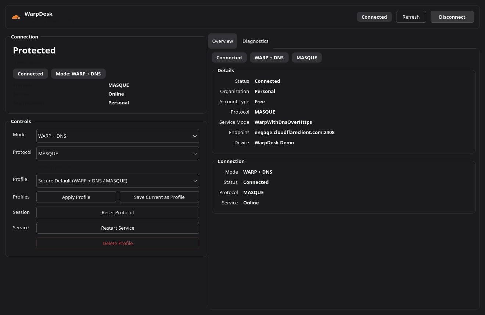

# WarpDesk

Interfaz de escritorio para Cloudflare WARP en Linux.

WarpDesk nació por diversión y para la comunidad. La idea es simple: no había una experiencia de escritorio realmente nativa y amable en Linux para quien solo quiere gestionar WARP con dos clics, sin abrir una terminal para una tarea cotidiana.

Made with 🖤 in Barcelona City 🇪🇸

Estado:

- mantenido por la comunidad
- abierto a co-mantenedores, traductores, gente de packaging y contribuidores



## Por qué existe

El flujo oficial de WARP en Linux funciona, pero sigue siendo demasiado orientado a consola si lo que buscas es:

- una ventana de escritorio adecuada
- una entrada en la bandeja con acciones rápidas
- un resumen compacto del estado de conexión
- cambiar modo y protocolo con facilidad
- guardar perfiles
- no memorizar comandos para el uso diario

WarpDesk mantiene `warp-cli` como backend y se centra en ofrecer una mejor experiencia de escritorio.

## Funcionalidades

- Conectar y desconectar desde una ventana Qt nativa
- Cambiar entre MASQUE y WireGuard
- Cambiar el modo de WARP
- Guardar perfiles
- Panel de diagnóstico
- Icono en bandeja con acciones rápidas
- Integración con menú de aplicaciones y acceso directo de escritorio
- Interfaz adaptada al idioma del sistema en inglés, español y catalán
- Uso de paleta del sistema para integrarse mejor en escritorios Linux

## Captura

La captura superior se genera desde la propia aplicación en modo offscreen y puede regenerarse con:

```bash
QT_QPA_PLATFORM=offscreen PYTHONPATH=src python3 scripts/generate_screenshot.py
```

## Requisitos

- Escritorio Linux
- Python 3.11+
- PySide6
- Cloudflare WARP instalado

Arch / CachyOS:

```bash
sudo pacman -S cloudflare-warp-bin
```

## Ejecutar desde código fuente

```bash
cd warpdesk
python3 -m venv .venv
source .venv/bin/activate
pip install -e .
warpdesk
```

## Instalar como app de escritorio

Esto crea:

- `~/.local/bin/warpdesk`
- `~/.local/share/applications/io.warpdesk.app.desktop`
- `~/Escritorio/WarpDesk.desktop`
- `~/.local/share/icons/hicolor/scalable/apps/warpdesk-shield.svg`

Ejecuta:

```bash
cd warpdesk
./scripts/install_local.sh
```

## Notas públicas

- WarpDesk depende de `warp-cli` y `warp-svc`
- desinstalar `cloudflare-warp-bin` elimina el backend que usa WarpDesk
- las acciones privilegiadas sobre el servicio dependen de `pkexec`

## Documentación

- [Arquitectura](docs/ARCHITECTURE.md)
- [Marca e iconos](docs/BRANDING.md)

## Hoja de ruta

La hoja de ruta vive como issues en GitHub para que el progreso sea visible y accionable.

## Contribuciones

Si quieres aportar una traducción para otro idioma, abre un pull request y estaré encantado de revisarlo e integrarlo si encaja bien en el proyecto. Lo mismo aplica a nuevas features, mejoras de UX, empaquetado o cualquier otra contribución útil.

Si este proyecto te resulta útil y quieres ayudar a mantenerlo vivo, también son bienvenidos nuevos mantenedores.
