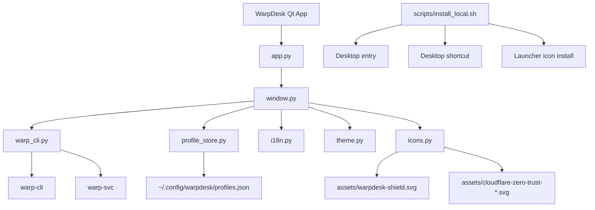

# Architecture

## Overview

WarpDesk is a thin desktop shell over Cloudflare's Linux backend.

Made with 🖤 in Barcelona City 🇪🇸

Layers:

1. `window.py`
   Main Qt window, tray icon, actions, status rendering.
2. `warp_cli.py`
   Wrapper around `warp-cli`.
3. `profile_store.py`
   JSON persistence for user-defined profiles.
4. `i18n.py`
   Locale-aware strings for `en`, `es`, and `ca`.
5. `theme.py`
   Compact palette-driven UI styling.

## Structure diagram



## Backend model

WarpDesk does not tunnel traffic itself.

It delegates to:

- `warp-cli`
- `warp-svc`

That means:

- backend bugs are backend bugs
- the GUI can improve UX, but not replace the WARP daemon
- uninstalling the official package removes the backend WarpDesk talks to

## Threading

UI actions run through a `ThreadPoolExecutor`.

Results are marshalled back into the UI thread through Qt signals in `UiBridge`.

This avoids the earlier bug where the window stayed in `Loading…`.

## State flow

1. poll timer triggers `refresh_state()`
2. `warp_cli.snapshot()` collects current state
3. UI receives a `WarpState`
4. widgets are updated in `_apply_state()`

## Profiles

Profiles currently store:

- `mode`
- `protocol`

Stored in:

```text
~/.config/warpdesk/profiles.json
```
